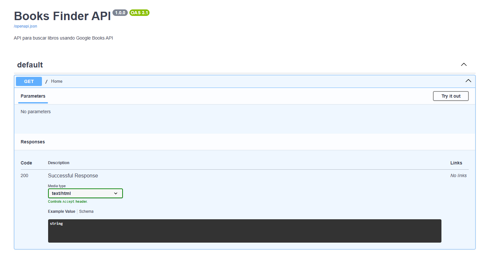
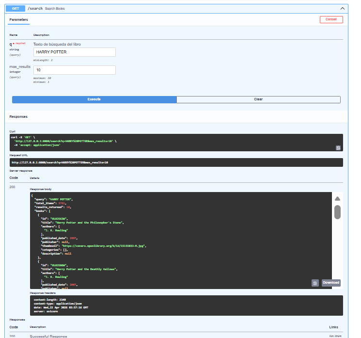
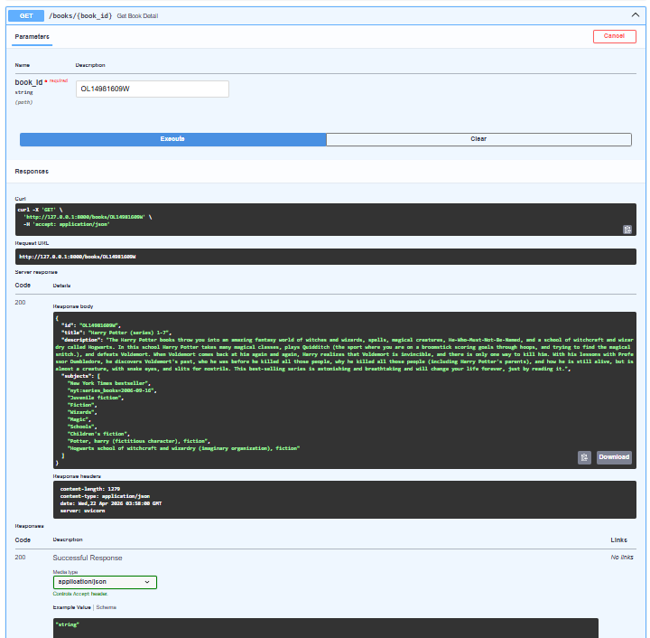

# 🕷️ Laboratorio 2: Web Scraping - Hacker News
# 📝 Descripción
Esta es una API funcional diseñada para la búsqueda y gestión de información bibliográfica utilizando la **Google Books API**. El sistema permite realizar consultas generales y obtener detalles específicos de obras literarias de forma estructurada.

## 🛠️ Tecnologías Utilizadas
* **Framework:** FastAPI
* **Servidor ASGI:** Uvicorn
* **Documentación:** Swagger UI / OpenAPI 3.1

## 🚀 Ejecución y Uso
1. **Instalar dependencias:** `pip install -r requirements.txt`
2. **Iniciar servidor:** `python -m uvicorn main:app --reload`
3. **Acceso a la documentación:** Abrir en el navegador `http://127.0.0.1:8000/docs`
## 🚀 Flujo del Proceso (Evidencias)

### 1. Documentación Interactiva (Swagger)
Punto de entrada principal de la API donde se listan los endpoints disponibles para interactuar con la base de datos de Google Books.

### 2. Endpoint de Búsqueda (`/search`)
Demostración de una búsqueda exitosa utilizando el parámetro `q=HARRY POTTER`. La API retorna una lista de resultados con títulos, autores y miniaturas.

### 3. Detalle de Libro por ID (`/books/{book_id}`)
Consulta específica de un ejemplar mediante su identificador único, devolviendo la descripción completa, categorías y datos editoriales detallados.

## 📂 Endpoints Principales
* `GET /`: Página de inicio de la API.
* `GET /search`: Motor de búsqueda con parámetros de consulta y límite de resultados.
* `GET /books/{book_id}`: Consulta detallada de un libro específico.
